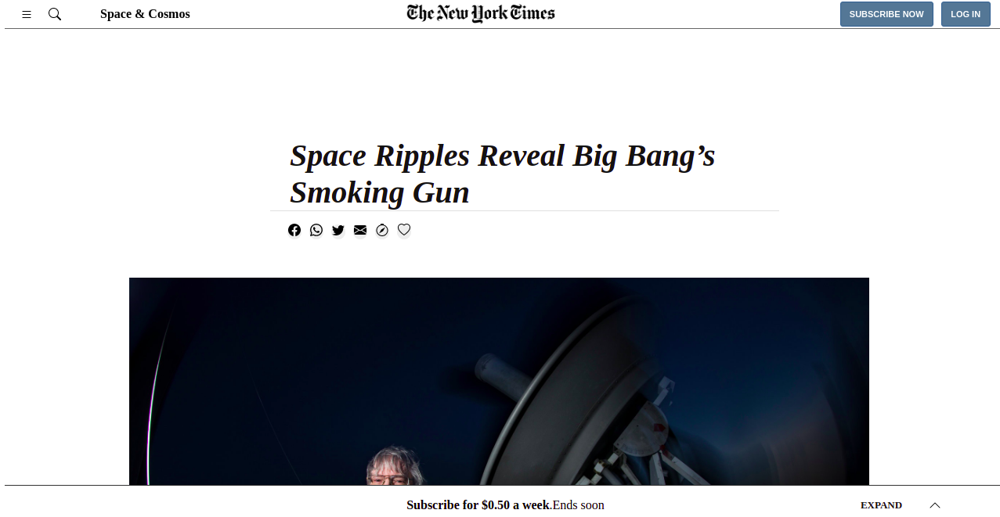
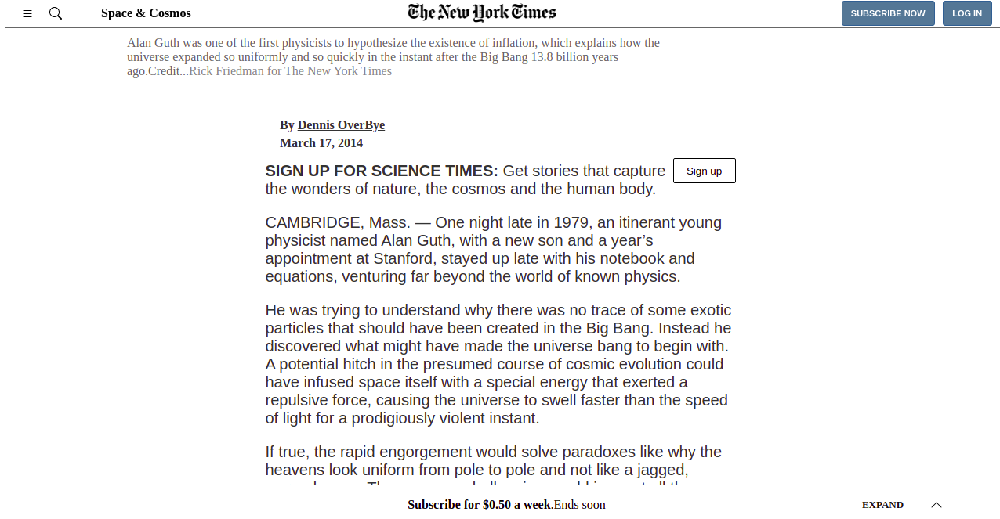
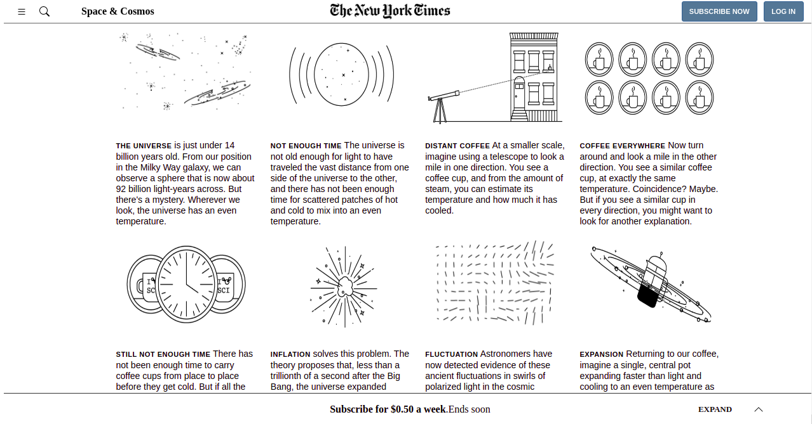
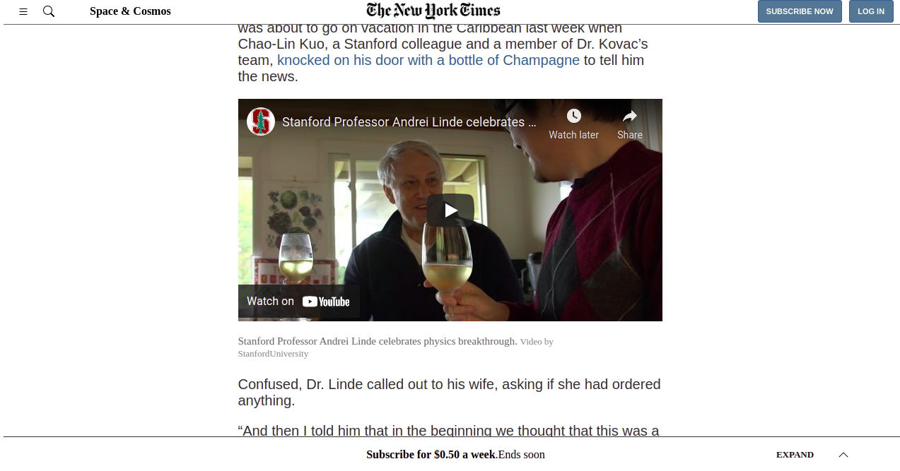
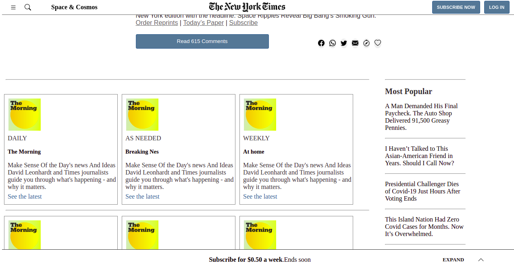
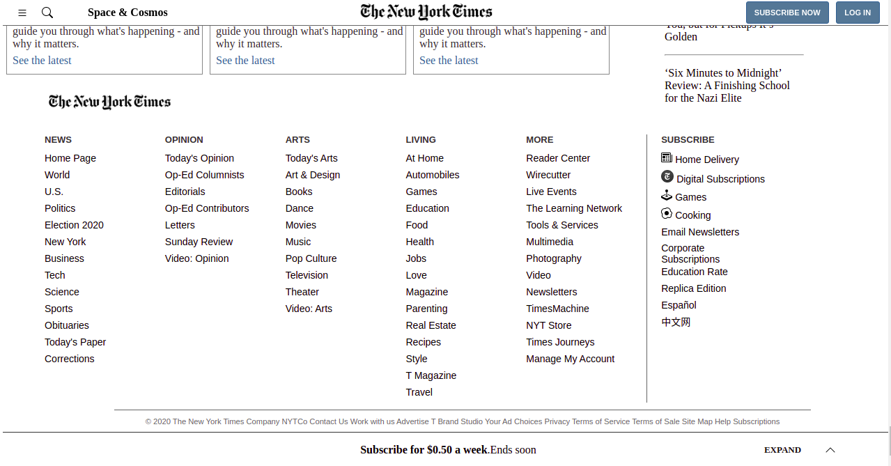

# The New York Times

> The New York Times Clone is a project for who are interested in knowing the news in the easiest way .

-Header Page

-Article Sections

-Books to read

-Fast footer links

## Built With

- Html/Css
- Microverse Linter

## Live Demo

[Live Demo Link](https://hamdiheb.github.io/new_york_times/)

## Installl

To get a local copy up and running follow these simple example steps.
- Open terminal
- Clone this project by command git clone https://github.com/hamdiheb/new_york_times.git
- Cd new-york folder
- Open index.html in browser

## Getting Started 
- Index.html is the main marke up that will show as the first page in the browser .
- In css folder you will find the css file that contain all applicated designing on this project .
- Img folder contain most of pictures that has been in use for this project

## Author

👤 **Iheb Hamdi**

- GitHub: [@githubhandle](https://github.com/hamdiheb)
- Twitter: [@twitterhandle](https://twitter.com/hamdiheb)
- LinkedIn: [LinkedIn](https://www.linkedin.com/in/hamdi-iheb-b3ba16206/)

## 🤝 Contributing

Contributions, issues, and feature requests are welcome!

Feel free to check the [issues page](https://github.com/hamdiheb/new_york_times/issues/2).

## Show your support

Give a ⭐️ if you like this project!
